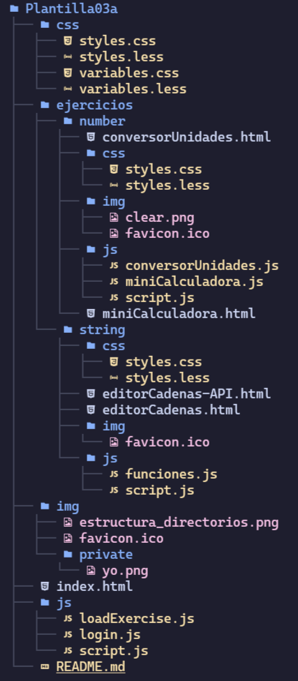

# JavaScript-ES6

## Finalidad de este repositorio

Este repositorio se ha credo buscando sumarizar los ejercicios de Javascript ES6 realizados durante las clases de Desarrollo Web en Entorno Cliente.

## Qué se va a encontrar

Tendremos una página de índice, que nos listará todos los ejercicios realizados y nos permitirá visualizarlos.

## Tecnologías utilizadas

- HTML
- CSS (less)
- JavaScript

## Estilos utilizados\*

### Paleta de colores

```less
@primary: #9ae19d;
@secondary: #909590;
@dark: #474a48;
@darker: #2c302e;
```

Se ha traído una paleta de colores de [Coolors](https://coolors.co/), se usará durante toda la aplicación.

\* Estos estilos se encuentran sujetos a cambios y pueden ser modificados en cualquier momento

## Estructura de directorios



## Gestión de login con Local Storage

Cuando el usuario se loguea exitosamente se almacena una variable booleana en el localStorage.

En el caso de que la variable exista y sea true no será necesario volver a iniciar sesión.
En caso contrario se pedirá un login.

## Conversor de cadenas con acceso peticion de datos a API de consejos

Es posible convertir cadenas de texto utilizando varias funciones comunes del objeto String de JS, moviéndonos entre mayúsculas y minúsculas, con una funcion que lo hace automáticamente.

Además se ha añadido la petición del texto a una API para que no sea necesario escribir la cadena manualmente.

**API utilizada**

https://api.adviceslip.com/advice
